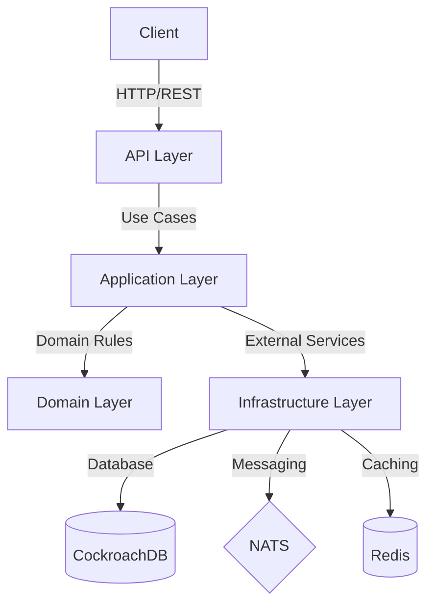

# Illuvium API

## Architecture Overview

The Illuvium API is built using a feature-first Clean Architecture approach powered by NestJS and TypeScript. This architecture provides clear separation of concerns, maintainability, and scalability for the Illuvium ecosystem's backend services.



## Technology Stack

- **Framework**: NestJS
- **Language**: TypeScript
- **Database**: CockroachDB with Kysely query builder
- **Message Broker**: NATS for event-driven communication
- **Caching**: Redis
- **API Style**: REST with Swagger/OpenAPI documentation
- **Authentication**: JWT-based
- **Testing**: Jest for unit tests, Supertest for e2e tests
- **Containerization**: Docker
- **Orchestration**: Kubernetes

## Clean Architecture Implementation

Each feature module implements the following layers:

### 1. Domain Layer
The core of the application containing business entities and rules that are independent of external frameworks:
- Entities (business objects)
- Value Objects (immutable objects with no identity)
- Repository Interfaces (defining data access contracts)
- Domain Services (complex operations on multiple entities)
- Domain Events (events that occur within the domain)

### 2. Application Layer
Contains the application's use cases and orchestrates the flow of data:
- Use Cases (application-specific business rules)
- DTOs (Data Transfer Objects)
- Application Services
- Event Handlers
- Validators

### 3. Infrastructure Layer
Provides implementations for external concerns:
- Repository Implementations
- Database Configuration (Kysely)
- External Services Integration
- Caching Mechanisms
- Message Queue Integration
- Logging and Monitoring

### 4. Interface Layer
Handles interactions with external systems:
- REST Controllers
- API Documentation (Swagger)
- Request/Response Formatters
- Authentication and Authorization Mechanisms

## Project Structure

```
src/
├── modules/                 # Feature modules
│   ├── assets/              # Assets feature module
│   │   ├── domain/          # Enterprise business rules
│   │   │   ├── entities/    # Business objects
│   │   │   ├── repositories/# Repository interfaces
│   │   │   └── value-objects/# Immutable objects
│   │   ├── application/     # Application business rules
│   │   ├── infrastructure/  # Frameworks & drivers
│   │   └── interface/       # Interface adapters
│   └── [other-modules]/
├── shared/                  # Shared code across modules
│   ├── domain/              # Shared domain objects
│   └── infrastructure/      # Shared infrastructure
│       ├── config/          # Configuration services
│       ├── database/        # Database connectivity
│       ├── exceptions/      # Global exception handling
│       ├── interceptors/    # Response transformation
│       └── pipes/           # Validation pipes
└── main.ts                  # Application entry point
```

## Key Features

### API Documentation
The API is fully documented using Swagger/OpenAPI, accessible at `/api/docs` endpoint.

### Error Handling
Comprehensive error handling with custom exception filters:
- `GlobalExceptionFilter`: Handles all unhandled exceptions
- `ValidationExceptionFilter`: Standardizes validation error responses

### Security
- CORS configuration with environment-specific settings
- Rate limiting to prevent abuse

### Database Management
- CockroachDB for scalable and distributed SQL database
- Kysely query builder for type-safe SQL
- Automatic schema setup and verification on application startup

### Monitoring and Logging
- Sentry integration for error tracking
- Structured logging for better observability

## Development Guidelines

### Coding Standards
- Follow SOLID principles
- Use TypeScript interfaces and types for better type safety
- Write comprehensive tests
- Use dependency injection for loose coupling
- Code should be self-documenting
- Implement proper error handling
- Use environment variables for configuration

### Adding New Features
1. Create a new module following the Clean Architecture pattern
2. Start with domain entities and value objects
3. Define use cases in the application layer
4. Implement repositories and external services in the infrastructure layer
5. Create controllers/resolvers in the interface layer
6. Add the module to the main application module

### Testing Strategy
- Unit tests for business logic
- Integration tests for repository implementations
- End-to-end tests for API endpoints

## Deployment

The application is containerized using Docker and can be deployed to Kubernetes. Environment-specific configuration is managed through environment variables.

## Performance Considerations

- Connection pooling for database access
- Redis caching for frequently accessed data
- NATS streaming for asynchronous processing
- Rate limiting to prevent API abuse

## Security Measures

- Input validation using pipes
- Authentication and authorization middleware
- CORS configuration
- Rate limiting
- Sanitization of error messages

---

*This architecture document provides an overview of the Illuvium API structure and design principles. For specific implementation details, please refer to the code documentation and comments.*
